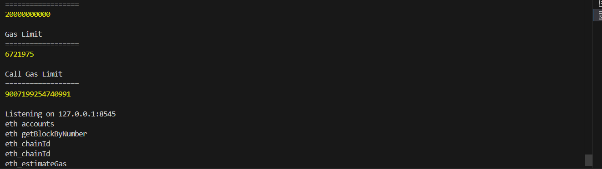
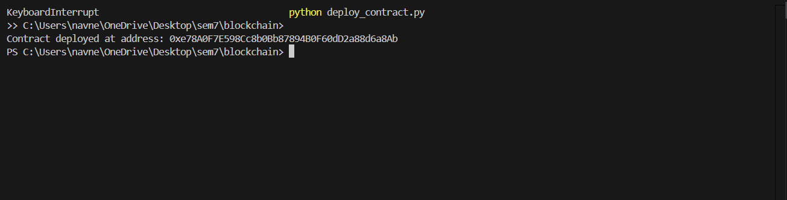
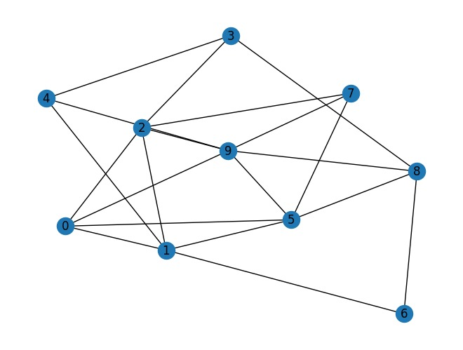
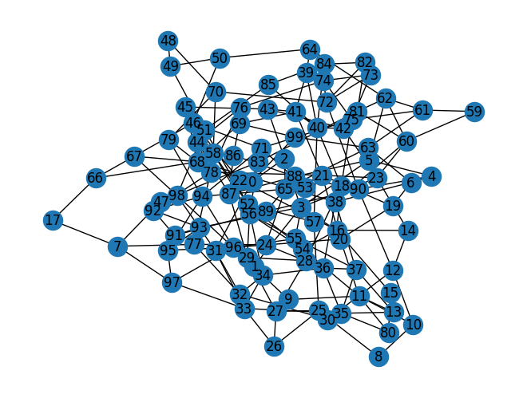
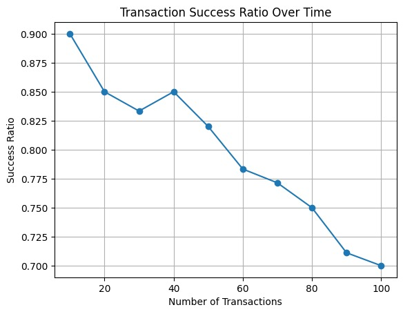
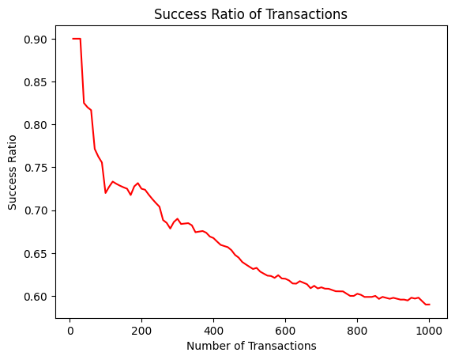

# **Report: Decentralized Application for Joint Accounts and Transactions**

## **B21CS050 and B21CS020**

## **Abstract**

This report describes the development of a decentralized application (DApp) that enables users to create joint accounts and perform transactions over a connected user network. The DApp simulates transactions between users using a network topology and evaluates the transaction success ratio over time. The project demonstrates the capabilities of Solidity-based smart contracts and Python scripting for off-chain computation.

---

## **Introduction**

Decentralized applications (DApps) operate on blockchain networks, eliminating the need for centralized servers. This DApp enables users to create joint accounts and transact over a user network, leveraging the Ethereum blockchain. The application facilitates transactions along the shortest path in a user network and maintains user balances throughout.

### **Objectives**

- Develop a smart contract to manage joint accounts and transactions.
- Simulate a network of users and perform transactions based on connectivity.
- Evaluate the transaction success ratio over 100 transactions.

---

## **Implementation Details**

Installation Instructions

1. **Install Node.js and npm**

   Download and install from the [official website](https://nodejs.org/).
2. **Install Ganache CLI**

   ```bash
   npm install -g ganache-cli
   ```

Start Ganache CLI:

1. **Open a terminal and run:**

```bash
ganache-cli -d
```



##### on running deployment script



then running the interact.ipynb file

### **1. Network Graph**

The network is represented as an undirected graph, where:

- **Nodes** represent users.
- **Edges** represent joint accounts with initial balances.


### **2. Smart Contract**

A Solidity smart contract was developed to:

1. **Register users** with unique IDs and usernames.
2. **Create joint accounts** between users, initializing their contributions.
3. **Transfer amounts** between users along the shortest path in the graph.
4. **Update balances** along the path while maintaining balance consistency.

#### **Key Functions**

- `registerUser`: Registers a user on the network.
- `createAcc`: Creates a joint account with an initial contribution.
- `sendAmount`: Transfers an amount from one user to another along a specified path.
- `closeAccount`: Closes a joint account between two users.

### **3. Off-Chain Computation**

The shortest path between users was computed off-chain using Python’s `networkx` library, and the path was passed to the smart contract for processing. This approach minimizes gas usage and computational overhead on the blockchain.

### **4. Transaction Simulation**

- **Number of Transactions**: 100/1000
- **Amount per Transaction**: 1 unit
- **Logic**: Random sender-receiver pairs were chosen. Transactions were processed only if sufficient balance existed along the path.

---

## **Results**

### **1. Network Graph**

The generated network graph for 10 users is displayed below:

graph with 10 users


graph with 100 users


### **2. Transaction Success Ratio**

The success ratio was calculated as the percentage of successful transactions to the total number of attempted transactions. A success is defined as a transaction where sufficient balance exists along the shortest path.

The graph below shows the transaction success ratio over 100 transactions:



The graph below shows the transaction success ratio over 100 transactions:

-------------

## **Discussion**

### **Findings**

- The initial success ratio was high (~90%) due to sufficient initial balances and connectivity.
- The success ratio gradually decreased over time as balances along the paths were depleted.
- The drop in success ratio highlights the importance of balance management and network connectivity in sustaining transactions.

### **Challenges**

1. **Gas Costs**: On-chain computation of the shortest path was avoided due to high gas requirements.
2. **Balance Consistency**: Ensuring accurate updates to user contributions along transaction paths was critical.

### **Optimizations**

- **Off-Chain Computation**: Leveraging Python for pathfinding reduced the on-chain computational burden.
- **Balance Initialization**: Ensuring non-zero initial contributions improved the likelihood of successful transactions.

---

## **Conclusion**

The project successfully demonstrated the functionality of a decentralized joint account system. The implementation highlights the interplay between on-chain and off-chain computations to optimize performance. The results show how network connectivity and balance management impact transaction success.

### **Future Work**

- Scale the network to more users and transactions.
- Implement additional features like dynamic balance adjustments and multi-party transactions.
- Explore alternative pathfinding algorithms to enhance efficiency.

---

## **References**

1. Ethereum Documentation: [ethereum.org](https://ethereum.org)
2. NetworkX Library: [networkx.org](https://networkx.org)
3. Solidity Documentation: [soliditylang.org](https://soliditylang.org)
